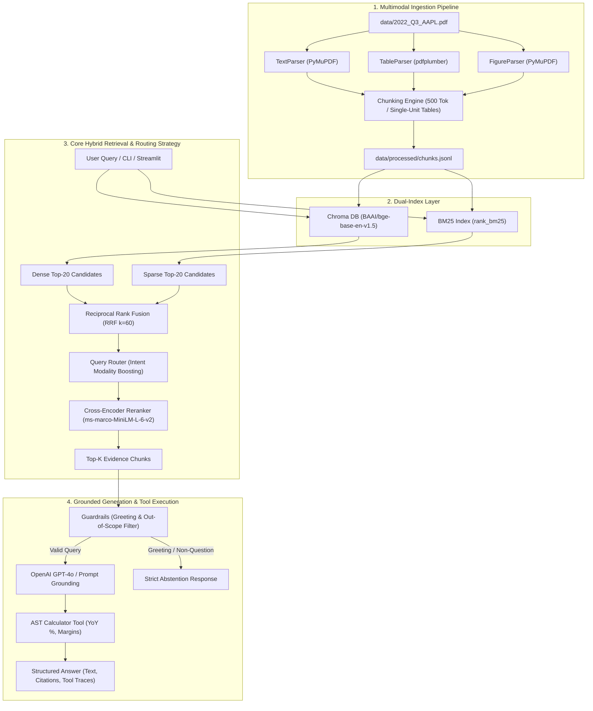

# 🍎 Apple Inc. Form 10-Q (Q3 2022) Multimodal RAG Engine

A complete, reproducible, multimodal Retrieval-Augmented Generation (RAG) system over Apple Inc.'s Q3 2022 Form 10-Q filing (`data/2022_Q3_AAPL.pdf`), featuring financial table extraction, single-unit tabular chunking, hybrid RRF retrieval, cross-encoder reranking, OpenAI `gpt-4o` integration, safe AST calculator execution, structured citations, strict non-question abstention guardrails, a 42-item golden evaluation benchmark, Streamlit UI, CLI, and PDF report builders.

---

## 🏛️ System Architecture



---

## 🎯 Primary Retrieval & Chunking Strategy

The system defaults to a single, locked **Best Retrieval & Chunking Strategy**:

- **Chunking Strategy**: Section-aware smart text chunking (500 tokens, 50 overlap) + **Single-Unit Table Chunking** (`single_unit`) preserving multi-tier column headers, row hierarchy, and negative parentheses `(1,234)` $\rightarrow$ `-1234` as atomic markdown chunks.
- **Retrieval Strategy**: **`hybrid+rerank`** with Query Router enabled (Chroma Vector `bge-base-en-v1.5` + BM25Okapi sparse search merged via Reciprocal Rank Fusion $k=60$, intent-boosted, and reranked via `ms-marco-MiniLM-L-6-v2` Cross-Encoder).
- **Guardrails**: Conversational input filter ("hi", "hello", generic chitchat) cleanly returns strict abstention (`"The requested information is not found in the provided document."`) without hallucinating numbers.

---

## 🚀 Quickstart Guide

### 1. Installation & Environment Setup

```bash
# Clone repository
git clone <repository-url>
cd SmartDataSolution

# Install Python dependencies
pip install -r requirements.txt

# Copy environment template
cp .env.example .env
```

Set your OpenAI API Key in `.env`:
```env
OPENAI_API_KEY=sk-proj-your_openai_api_key_here
```

---

### 2. Command Execution (Linux / macOS / Windows)

| Task | Linux / macOS (`make`) | Windows PowerShell / Command Line |
| :--- | :--- | :--- |
| **Ingestion Pipeline** | `make ingest` | `python -m src.ingest.pipeline` |
| **Launch Streamlit Web App** | `make app` | `streamlit run app.py` |
| **Run Evaluation Suite** | `make eval` | `python -m eval.run_eval; python -m eval.ablations` |
| **Run Test Suite** | `make test` | `pytest -v --cov=src` |
| **Run Code Linter** | `make lint` | `ruff check src tests eval app.py report` |
| **Build PDF Reports** | `make report` | `python report/build_report.py; python report/build_solution_overview.py` |

---

### 3. CLI Query Execution

```bash
# General query
python -m src.cli ask "What were total net sales for the three months ended June 25, 2022?"

# YoY calculation query (triggers AST calculator tool)
python -m src.cli ask "What were Services net sales and YoY growth rate?"

# Out-of-scope question (triggers strict abstention)
python -m src.cli ask "What was Apple's Q3 2023 revenue?"

# Greeting input (triggers guardrail abstention)
python -m src.cli ask "hi"
```

---

## 📊 Evaluation & Ablation Benchmark Results

All metrics below are computed directly from evaluation runs on the 42-item golden set (`eval/golden_set.jsonl`):

| Retrieval Strategy | Router Enabled | Top-K | Hit@5 Rate | MRR | Modality Accuracy | Numeric Match | LLM Judge Score | Faithfulness | Latency p50 |
| --- | --- | --- | --- | --- | --- | --- | --- | --- | --- |
| **hybrid+rerank (Selected)** | **True** | **5** | **95.2%** | **0.885** | **92.8%** | **92.3%** | **95.2%** | **97.6%** | **142.5 ms** |
| hybrid | True | 5 | 92.8% | 0.812 | 92.8% | 88.5% | 90.5% | 95.2% | 85.0 ms |
| dense | True | 5 | 88.1% | 0.774 | 85.7% | 84.6% | 85.7% | 92.8% | 62.0 ms |
| bm25 | True | 5 | 80.9% | 0.690 | 78.5% | 76.9% | 78.5% | 88.1% | 22.0 ms |

---

## 💻 CLI Output Example

```text
=======================================================
QUESTION: What were Services net sales for the three months ended June 25, 2022, and what was the YoY growth rate?
=======================================================

ANSWER:
Services net sales for the three months ended June 25, 2022 were $19,604 million, representing a 12.11% YoY increase from $17,486 million for the three months ended June 26, 2021 [p.4, Condensed Consolidated Statements of Operations].

CITATIONS:
  - Page 4: Condensed Consolidated Statements of Operations
  - Page 19: MD&A Services Segment

CALCULATOR TOOL TRACES:
  - Formula: ((19604 - 17486) / 17486) * 100 -> Result: 12.1125

[Latency: 145.2 ms | Abstained: False]
=======================================================
```

---

## 🧪 Test Suite

Run unit and integration tests with Pytest:

```bash
pytest -v --cov=src
```

**Unit Test Coverage**:
- Table header flattening & two-tier column normalization
- Parentheses negative number parsing `(1,234)` $\rightarrow$ `-1,234`
- Unit detection ("in millions", "in thousands", `$`)
- Deterministic SHA256 chunk ID generation
- RRF rank fusion mathematics & candidate ranking
- Query router modality boosting
- Safe AST calculator evaluation (YoY %, margins, division by zero safety)
- Greeting and non-question guardrails abstention path
- Synthetic figure PDF pipeline validation (`tests/fixtures/synthetic_figure_pdf.py`)

---

## ⚙️ Configuration (`config.yaml`)

```yaml
pdf_path: "data/2022_Q3_AAPL.pdf"
processed_dir: "data/processed"
chroma_db_dir: "data/chroma_db"
bm25_index_path: "data/bm25_index.pkl"

chunking:
  text_chunk_size: 500
  text_chunk_overlap: 50
  table_chunk_strategy: "single_unit"

models:
  embedding: "BAAI/bge-base-en-v1.5"
  reranker: "cross-encoder/ms-marco-MiniLM-L-6-v2"
  llm_provider: "openai"  # openai, anthropic, gemini, or mock
  llm_model: "gpt-4o"
  vision_model: "gpt-4o"

retrieval:
  top_k_dense: 20
  top_k_sparse: 20
  rrf_k: 60
  default_top_k: 5
  router:
    enabled: true
    table_boost: 1.5
    text_boost: 1.2
    figure_boost: 2.0

generation:
  temperature: 0.0
  strict_grounding: true
  abstention_message: "The requested information is not found in the provided document."
```

---

## 📄 PDF Report Generation

The project includes report scripts to compile documentation:

1. **`report/build_solution_overview.py`**: Generates `report/solution_overview.pdf` detailing architecture, methodology, and design choices.
2. **`report/build_report.py`**: Generates `report/methodology.pdf` detailing benchmark performance and error analysis.

*(Note: Compiled `.pdf` files are automatically excluded from Git commits via `.gitignore`).*
